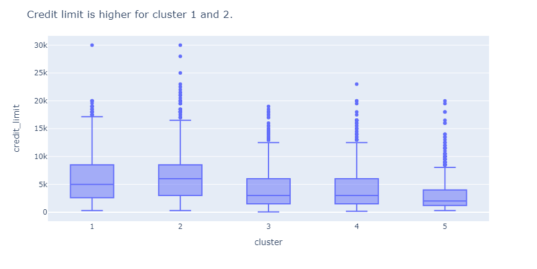
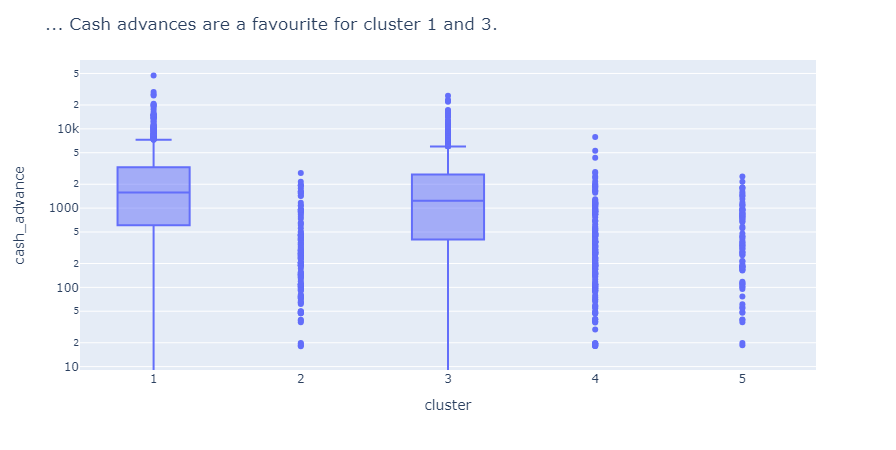
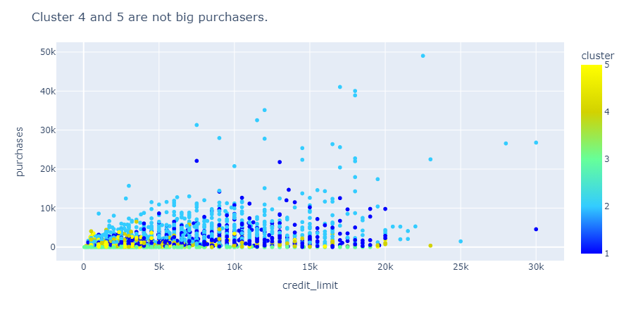

# Credit Card Clustering
The aim of this project is to target customers with a tailored marketing strategy using clusterng. The analysis covers various aspects, including exploratory data analysis (EDA), PCA, clustering using K-Means, and deriving marketing strategies based on the identified customer clusters.

## Data Source
The data comes from [Kaggle](https://www.kaggle.com/datasets/arjunbhasin2013/ccdata) and it contains the data of 
9000 active credit card holders during the last 6 months. 

## Requirements
Make sure you have the following packages installed:
* **numpy** and **pandas** for reading and manipulations
* **plotly_express** and **plotly.graph_objects** for interactive plotting
* **scikit-learn** for Principal Component Analysis (PCA) and clustering (K-Means)

## Conclusions

The final five customer clusters are :
* Cluster 1 (Active Cash Advance Customers)
They have a high limit than most and they use it for purchasing stuff. Additionally, they make use of installments and a bit of cash advances.

* Cluster 2 (All-in Active Customers)
They have a higher limit than Cluster 1, however they purchase even more frequently and have a higher use of installments.

* Cluster 3 (Cash Advance Customers)
They have a lower limit and use a higher proportion of it for cash advances than others.

* Cluster 4 (Dead Customers)
They do no do much. They do not buy, they do not take cash advances.

* Cluster 5 (Installment Customers)
They prefer safety and therefore to make purchases via installments, and do not take any cash advance.

Here are some findings that helped clustering customers:

## Marketing Strategies
To make sure we keep customers in the business we have a marketing strategy set for each one of them.

**Cluster 1 (Active Cash Advance Customers):**

* How: Provide discounts or rewards for specific purchase categories.
* Why: Maintain the interest.

**Cluster 2 (All-in Active Customers):**
* How: Introduce exclusive rewards for high-frequency transactions.
* Why: This group has the money and like to spend it.

**Cluster 3 (Cash Advance Customers):**
* How: Explore other credit card types e.g. low cash advance but low fees and higher tenure.
* Why: Too frequent cash advances are risky for a bank. In the best case, this group of customers would decrease in size and move to the Active Customer group.

**Cluster 4 (Dead Customers):**
* How: Consider contacting customers with surveys to understand their disengagement reasons.
* Why: This group would need to be understood first before targeting with a marketing technique.
Why don't they purchase? Are these people with lower income, are they young?

**Cluster 5 (Installment Customers):**
* How: Develop partnerships with merchants offering installment-friendly services and potentially that are low in interest.
* Why: It is scalable across other clusters e.g. dead customers. 